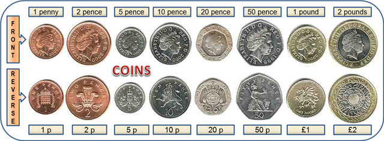

# Coding Test

Hi Rakesh Chaudhary!

Software engineering is at the heart of what we do here at giffgaff. Our agile engineering teams build and support a wide variety of applications and services. These combine to create our unique user experience on the giffgaff website, enable a whole range of awesome features via modern APIs and, additionally, enable our internal teams to work in the most productive and efficient ways.

The quality and maintainability of our software is very important to us, so we are looking for engineers with real-world experience of building and running contemporary software, especially in terms of the whole development lifecycle. You will help us to design and implement tightly focussed APIs, user interfaces, services that internalise our core business logic or internal tools and, together with your team, you will support them in production. We want you to share your opinions on how we are doing things - and help us get better!

## Have you got what it takes?

<details>
  <summary>Basic Expectations</summary>
  <br/>
  <ul>
    <li>Love delivering a wow to our members</li>
    <li>Ability to communicate clearly</li>
    <li>Be curious & creative</li>
    <li>Have excellent attention to detail</li>
    <li>Have an interest in technology, mobile and wider popular culture trends</li>
    <li>Able to work under pressure and manage workloads effectively</li>
    <li>Organised, self motivated and accountable for own workload</li>
    <li>A strong team player</li>
  </ul>
  <br/>
</details>
<details>
  <summary>Key Attributes & Behaviours</summary>
  <br/>
  <strong>Community & Connectedness</strong>
  <p>A person with community & connectedness skills has a sense of being part of a larger whole, a desire to contribute, a sense that the other people (i.e. coworkers, users, members) are not simply characters in his or her own movie, but fully-realised individuals.</p>
  <ul>
    <li>Coach & Mentor</li>
    <li>Courageous & Honest</li>
    <li>Code with Empathy</li>
    <li>Open Source Approach</li>
  </ul>
  <br/>
  <strong>Leadership</strong>
  <p>A person with leadership skills knows how to develop and follow a sense of purpose, in themselves and in others. They are willing to point out, own, and fix things that are broken about our company and in their own career tracks.</p>
  <ul>
    <li>An Owner’s Mindset</li>
    <li>Good at Persuasion</li>
    <li>A Sense of Purpose</li>
    <li>Do the Next Right-Thing</li>
  </ul>
  <br/>
  <strong>Technical Capability</strong>
  <p>A person with high technical capability is technically curious, tackles problems without giving up, and produces solutions that less-experienced folks can use, maintain, and learn from.</p>
  <ul>
    <li>Creative & Curious</li>
    <li>Disciplined & Rigorous</li>
    <li>Fearless & Pragmatic</li>
    <li>Good at Problem Solving</li>
    <li>A Propensity to Ship</li>
  </ul>
  <br/>
</details>
<details>
  <summary>Core Engineering Skills</summary>
  <br/>
  <table>
    <tr><td rowspan="4" valign="top">Must Have</td><td>Reading & Writing Code</td></tr>
    <tr><td>Variables & Control Structures</td></tr>
    <tr><td>Debugging & Troubleshooting</td></tr>
    <tr><td>IDE & OS Basics</td></tr>
    <tr><td rowspan="4" valign="top">Should Have</td><td>Test Driven Development</td></tr>
    <tr><td>Pair Programming</td></tr>
    <tr><td>Clean Code & Refactoring</td></tr>
    <tr><td>Version Control</td></tr>
    <tr><td rowspan="6" valign="top">Could Have</td><td>Continuous Integration & Deployment</td></tr>
    <tr><td>Algorithms & Data Structures</td></tr>
    <tr><td>Dependency Injection</td></tr>
    <tr><td>Mocks & Stubs</td></tr>
    <tr><td>Alerting & Monitoring</td></tr>
    <tr><td>Functional & Non-Functional Testing</td></tr>
    <tr><td rowspan="4" valign="top">Would Like</td><td>SOLID Principles</td></tr>
    <tr><td>Containerisation & Networking Basics</td></tr>
    <tr><td>Twelve Factor App Design</td></tr>
    <tr><td>Solution Architecture</td></tr>
  </table>
</details>
<details>
  <summary>Our Technology Stack</summary>
  <br/>
  <table>
    <tr><td rowspan="8" valign="top">Client-Side</td><td>CSS3</td></tr>
    <tr><td>ECMAScript (ES6+)</td></tr>
    <tr><td>HTML5</td></tr>
    <tr><td>Jest</td></tr>
    <tr><td>React</td></tr>
    <tr><td>React Native</td></tr>
    <tr><td>SASS</td></tr>
    <tr><td>TypeScript</td></tr>
    <tr><td rowspan="6" valign="top">Server-Side</td><td>Java 8 with Maven</td></tr>
    <tr><td>JUnit</td></tr>
    <tr><td>Node JS</td></tr>
    <tr><td>PHP & Laravel</td></tr>
    <tr><td>Python</td></tr>
    <tr><td>Spring Framework</td></tr>
    <tr><td rowspan="8" valign="top">Additional</td><td>Apache & NGINX</td></tr>
    <tr><td>AWS</td></tr>
    <tr><td>Jenkins</td></tr>
    <tr><td>DynamoDB, PostgreSQL, Redis & Oracle</td></tr>
    <tr><td>Docker & Kubernetes</td></tr>
    <tr><td>ElasticSearch & Kibana</td></tr>
    <tr><td>Grafana & Prometheus</td></tr>
    <tr><td>Kinesis</td></tr>
  </table>
</details>

## The Challenge

We would like you to complete the following coding exercise.

You can use any programming language you like. Ideally your solution will include unit tests, preferably written using a [test-driven development](https://en.wikipedia.org/wiki/Test-driven_development) approach. The code related to your solution should be placed in a subfolder and be easy to execute - ideally **clone** → **install** → **run**

Please commit your code back to this repository frequently. We expect you to complete this exercise within a day, but if takes a little longer don't worry - just let us know when you're done.

> NOTE: Due to 2FA if you're using HTTPS to access this repo, you must create a personal access token to use as a password when [authenticating to GitHub on the command line using HTTPS](https://help.github.com/en/github/authenticating-to-github/accessing-github-using-two-factor-authentication#authenticating-on-the-command-line-using-https) URLs.


---

<details>
<summary>Exercise 1 (90 minutes)</summary>

---

## Coin Machine

### Requirements:

You have to write an algorithm that takes a monetary value, calculates the fewest coins possible to make that change and return a list of how many of each coin is returned
i.e. an input of £2 should return `1 x £2 coin` and an input of £2.53 should return `1 x £2, 1 50p, 1 2p, 1 1p`

The coins in the machine are:



#### Input Format:

If the input starts with a pound symbol ("£") or if the number is a float, the value is in pounds, otherwise consider it as pennies. When the input
is badly formatted the interface can throw an exception or anything suitable for the language you are using.

### Example Test Data:

```
|Input| Output                         |
|£2   | 1 £2                           |
|253  | 1 £2, 1 50p, 1 2p, 1 1p        |
|5.23 | 2 £2, 1 £1, 1 20p, 1 2p, 1 1p  |
|$23  | Throw sensible exception       |
```

### Stretch/Extended Functionality

Start the machine with a state of coins which get consumed as change is given out. This will add restrictions to what coins you have available and will mean you have to give more than the theoretical minimum coins. What will you do when the full change amount can't be given?

</details>

---


Good Luck!

#### Generated for [rakeyshc](https://github.com/rakeyshc) on Thu Jan 19 2023 17:21:06 GMT+0000 (Coordinated Universal Time)